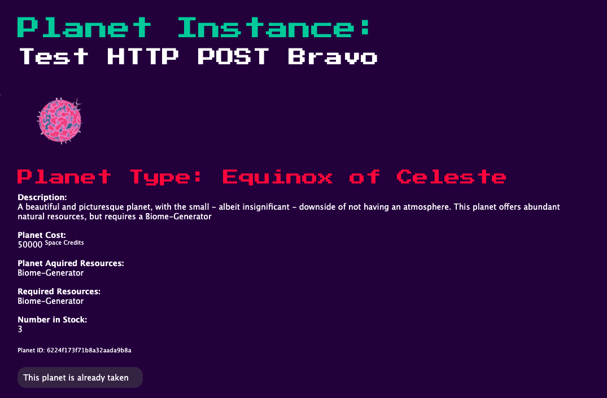
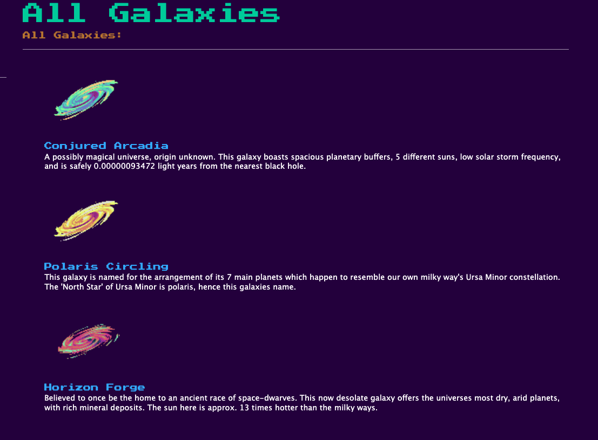
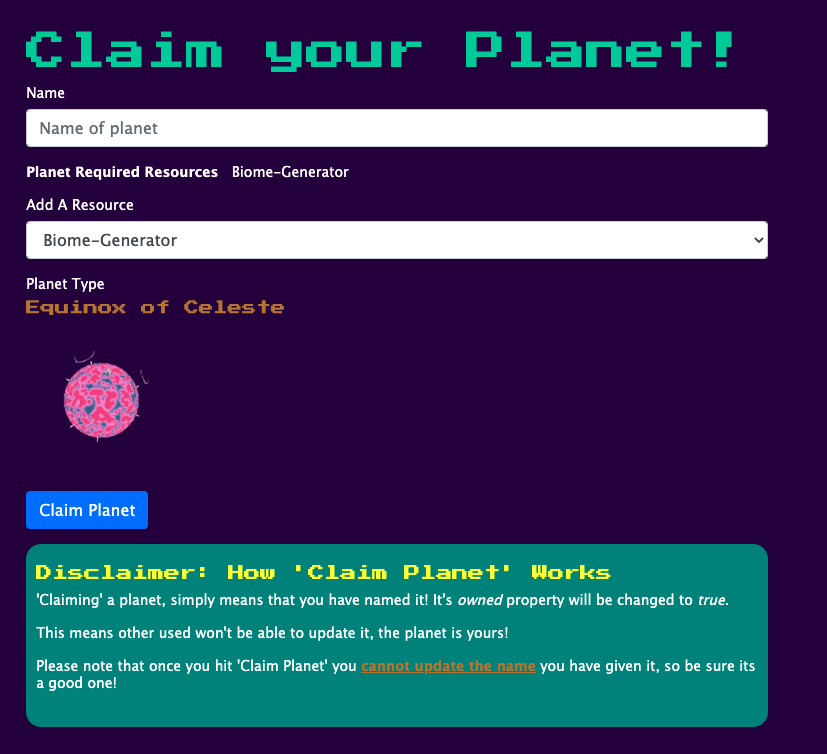

# Planets-R-Us
### *Your go-to source for intergalactic conquest!*
#### An "inventory like app" to learn and practice: Node, Express, MongoDB via Mongoose, and pug


## Functionality
- Fully functional MongoDB database
- Input validation on Planet Instance names
- Unique data points (Galaxies) with their own set of unique planets

## Technologies Used
- Node 
- Express
- MongoDB
- Mongoose
- Pug 
- Express Validator
- Bootstrap
- Heroku
- async package 
- dotEnv package

### Things I Learned
- Data Modelling with Mongoose
- Basic UML (Unified Modelling Language) 
- Basic Bootstrap


## UML association diagram 
Below is the authors humble attempt to map out the database structure to give you, the reader, a visual representation of how this application will use MongoDB and Mongoose to implement an MVC project architecture.


### View Planet Instance details
##### Is it already owned? What planet type is it? How much does it cost? Find out this and more at:
```/planetary-registry/galaxy/:planetInstance_id```

<br>

<br>

###View a list of all Galaxies available from Planets-R-Us
#### Each galaxy has a brief description as well as list of the planets that it contains. View here

```/planetary-registry/galaxies```

<br>

<br>

### Claim your planet before its gone!
##### Claiming a planet lets you give it a unique and official sounding name! But be careful, once its named it cannot be changed, edited or removed! 


## Attribution
- Planet and Galaxy Images: Create via [Deep-Folds](https://deep-fold.itch.io/pixel-planet-generator) generator 