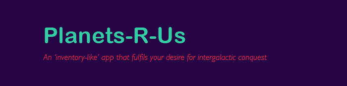
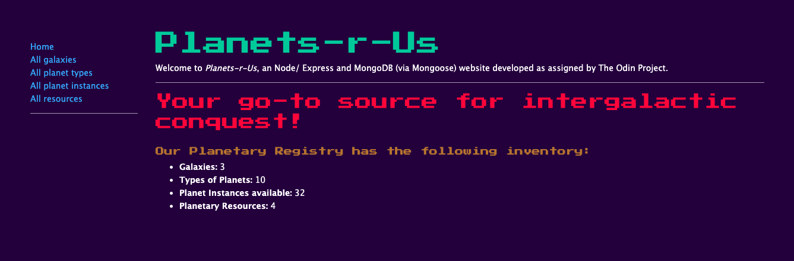
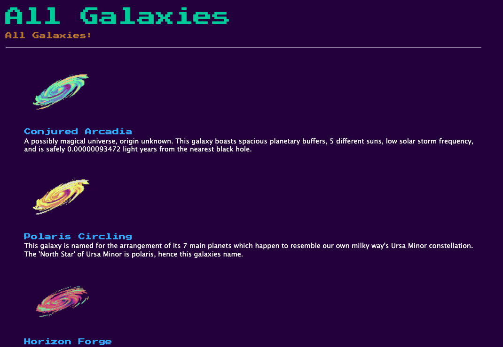
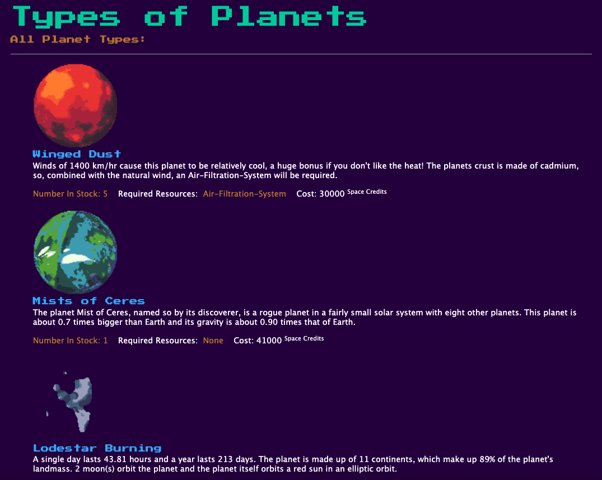
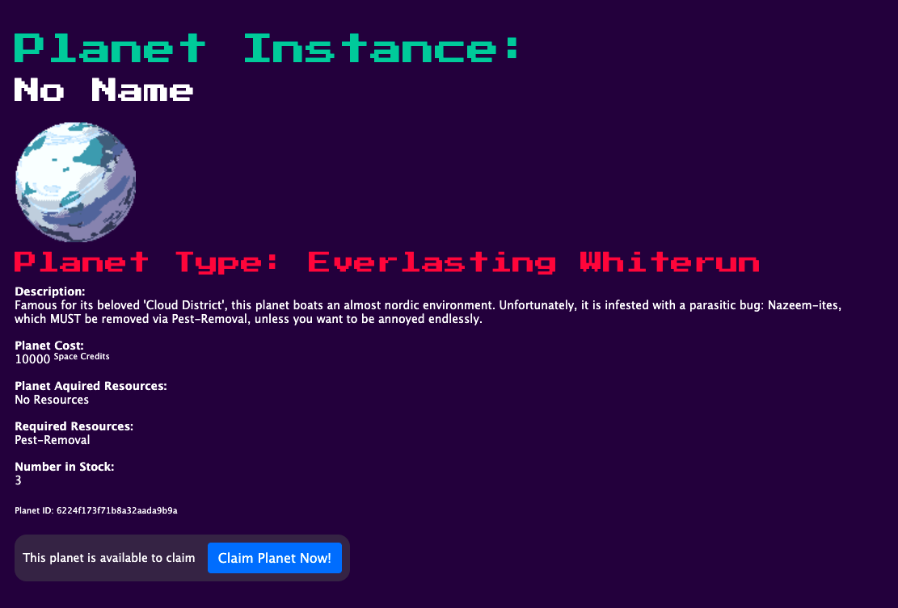
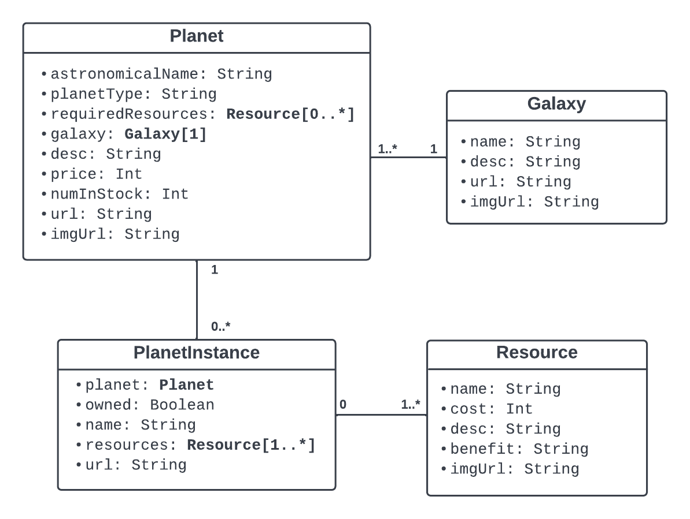

<div align="center">

## Planets-R-Us

### *Your go-to source for intergalactic conquest !*
An "inventory like app" to learn and practice: Node, Express, MongoDB (via Mongoose), and pug



</div>

### Table Of Contents:
1. [Live Deployment](#link-to-deployment)
2. [Getting Started](#getting-started)
3. [Description](#description)
4. [Pictures](#pictures)
5. [Functionality](#functionality)
6. [Technologies Used](#technologies-used)
7. [Things I Learned](#things-i-learned)
8. [License](#license)
9. [Acknowledgements](#acknowledgements)

### Link To Deployment
🖥 &nbsp; View a live demo of this project at: [Planets-R-Us](https://planets-r-us.herokuapp.com/)

<sup>[Back to top](#table-of-contents)</sup>

## Getting Started

1. ⬇️ Clone the repository to your local machine
   ```shell
   git clone git@github.com:EpictetusZ1/planets-r-us.git
   ```
2. Install project dependencies with npm
   ```shell
   npm install
   ```
3. 🏃‍ Run project
   ```shell
   npm run start
   ```

<sup>[Back to top](#table-of-contents)</sup>

## Description
An assignment from [The Odin Project](https://www.theodinproject.com/)

### Claim your planet before its gone!
Claiming a planet lets you give it a unique and official sounding name!

Beware, once its named it cannot be changed, edited or removed!

This app operates on an anonymous first come, first served basis. Go to the deployment, find an unclaimed planet, claim and make it yours!


<sup>[Back to top](#table-of-contents)</sup>

## Pictures

Project Homepage



Galaxy list



Planet Type list



Planet instance detail page



Below is the authors humble attempt to map out the database structure to give you, the reader, a visual representation of how this application will use MongoDB and Mongoose to implement an MVC project architecture.



<sup>[Back to top](#table-of-contents)</sup>

## Functionality

- Input validation on Planet Instance names, and "required-resources" for the Planet Type
- Unique data points (Galaxies) with their own set of unique planets
- Fully functional MongoDB integration
- CRUD operations available on unclaimed planets
- Read only operations available on claimed planets


<sup>[Back to top](#table-of-contents)</sup>

## Technologies Used

- Node
- Express
    - async package
    - dotEnv package
    - Express Validator
- MongoDB
    - Mongoose
- Pug (Templating language)
- Bootstrap
- Heroku


<sup>[Back to top](#table-of-contents)</sup>

## Things I Learned

- CRUD Operations in Express / MongoDB
- Generating simple user interfaces with a templating language
- Forms and server side validation
- Data Modelling with Mongoose
- Basic UML (Unified Modelling Language) for planning project architecture
- Basic Bootstrap, including 'Helper Classes'


<sup>[Back to top](#table-of-contents)</sup>

## License
Distributed under the MIT License. See `LICENSE.txt` for more information.

<sup>[Back to top](#table-of-contents)</sup>

## Acknowledgements

#### Planet and Galaxy Images:
- Create via [Deep-Folds](https://deep-fold.itch.io/pixel-planet-generator) generator, follow them on [Twitter](https://twitter.com/Deep_Fold)

<hr/>

Project was authored by Jack Heaton - ([EpictetusZ1](https://github.com/EpictetusZ1)).

<sup>[Back to top](#table-of-contents)</sup>
